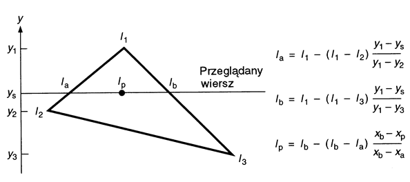
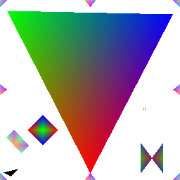

# RGB triangle generator (hybrid x86-64)
Mini-project for exploring x86-64 assembly language.

The program provides an interactive console line interface for drawing colorful triangles on RGB24 pixelmap and saving it to file.  
By default, program runs in non-interactive mode drawing the testing set of triangles and exiting. Interactive mode can be entered by supplying `--interactive` program argument.  
Pixelmap dimensions and output file name can be specified as program's arguments. Triangle's color and position are to be supplied using the CLI (`draw` command). Additionally, output file name can be supplied in the same manner (as an argument to `save` command).  
In order to determine boundaries of the triangle and correctly mix colors, linear interpolation is used:  

Non-interactive program execution should result in the following image:  

The project was carried out as an assignment for CPU architecture-related subject.  
Make sure to check out its other incarnations: [MIPS-32 version](https://github.com/Dove6/RGB-triangle-generator-MIPS), [x86/C version](https://github.com/Dove6/RGB-triangle-generator-x86).

## Building
The tool can be easily built using make. It requires GCC (MinGW on Windows) compiler and NASM assembler.

## Usage
SSE2 instruction support is needed in order to successfully run the program.  
For starting the program use:  
`rgb_triangle [--interactive] [output_filename [bitmap_width bitmap_height]]`  
where `output_filename` specifies the default output file and `bitmap_width` and `bitmap_height` defines the bitmap dimensions.  
By using `--interactive` switch you can enter the interactive mode where the following internal CLI instructions are supported:

| Instruction  | Arguments                       | Description                                                         |
| ------------ | ------------------------------- | ------------------------------------------------------------------- |
| `help`       | -                               | shows help message                                                  |
| `draw`       | `x y color x y color x y color` | draws a triangle                                                    |
| `clear`      | `[color]`                       | fills the bitmap using a color (default: #ffffff)                   |
| `save`       | `[filename]`                    | saves the bitmap to a file (default: specified as program argument) |
| `kill`       | -                               | exits the program without saving the bitmap                         |
| `quit`       | -                               | exits the program saving the bitmap to the default file             |

`color` can be provided as `#rrggbb` hex value or `rrr ggg bbb` decimal value set.
